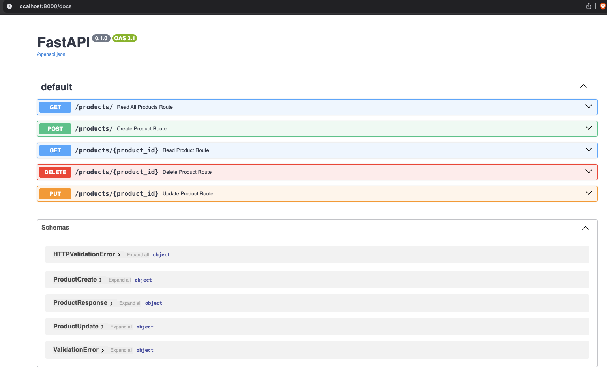
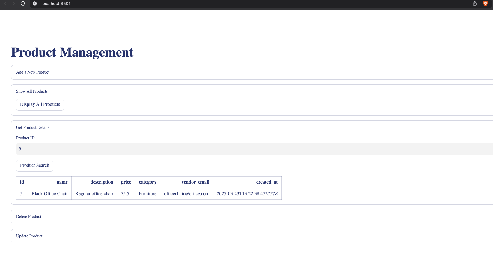

# CRUD Project
I developed this basic CRUD project to test my knowledge of Python, SQL, APIs and Docker.

The acronym CRUD stands for possible operations on a database: Create, Read, Update and Delete. The objectives of this project were:

- Structure the database backend to support these operations, using Python, SQLAlchemy, Pydantic and FastAPI.

- Create a frontend application to perform operations on the database, using Streamlit and Requests

- Configure the Docker files to guarantee the integrity of the solution/application on other devices and operating systems.

## 1. Business Problem
Every company that sells products needs a way to manage/monitor its product catalog, and many small companies do this through spreadsheets or other inefficient means.

In light of this, the company in question would like to modernize the way they manage their product catalog, by having a website or platform where the user can view, add, delete or update a product.

## 2. Project Stages
1. Create and configure a PostgreSQL database using Python + SQLAlchemy
2. Create the products table in the database using Python + SQLAlchemy
3. Configure the table's CRUD operations using Python + SQLAlchemy
4. Validate the operations on the database table, as well as the data types, using Pydantic
5. Enable the execution of CRUD operations using an API, creating a route for each operation, using FastAPI
6. Create an application that allows the user to perform operations on the database easily and directly, using Streamlit + Requests
7. Finally, configure the Docker files to allow the solution to be replicated on other devices.

## 3. Project Details
To make the project easier to develop and maintain, I divided it into two parts:

### 3.1 _Backend_ (Database & API)

The final product of this part of the project was an API, which is responsible for communicating between the _Frontend_ application and the PostgreSQL database.

To do this, we have the following files:

- `database.py` = responsible for creating the PostgreSQL database using SQLAlchemy, for creating the connection to the database and also for creating the database session.
- `models.py` = is responsible for defining the SQLAlchemy models, which are the classes that define the database tables. This is where we define the name of the table, the fields and the data types.
- `schema.py` = is responsible for defining Pydantic's schemas, which are the classes that define the types of data that will be used in the API. These schemas are used to validate the data that is received by the API, and also to define the types of data that are returned by the API.
    - As a good practice, I created different schemas for the API responses, allowing more flexibility to change the schemas if necessary.
- `crud.py` = responsible for defining the CRUD functions, which are used to perform operations on the database.
- `router.py` = is responsible for defining the API routes using FastAPI. This is where we define the routes, and also the CRUD functions/operations that will be executed on each route.
- `main.py` = is responsible for defining the FastAPI application and also for defining the Uvicorn web server.

With the backend files developed and the `Dockerfile` properly configured, when we build the Image and create the Container, we have our API working, and we can see its documentation by going to http://localhost:8000/docs

On this page we have the details of the API, as well as its parameters, with the possibility of testing some things:



With the API working and properly tested, it's time to focus on the frontend application.

### 3.2 _Frontend_ (Application)
The frontend consists of a single file (`app.py`), which creates a Streamlit application that connects to the API created in the backend via the Requests library, and is responsible for translating user inputs into the CRUD operations that have been configured.

With the file developed and the `Dockerfile` configured, by building the Image and creating the Container, we will have our frontend application up and running, which can be accessed at http://localhost:8501/.

On this page we will have different fields for the user to carry out CRUD operations (add, remove or update products, as well as check the details of all or a specific product):



### 3.3 Using Docker

As a way of ensuring the integrity of the application as a whole on different devices and operating systems, I used Docker.

To do this, as mentioned above, I created a `Dockerfile` for the backend and the frontend, and to run both I created the file `docker-compose.yml`

This way, for the application to work, all you have to do is type the following command into the terminal:

```bash
docker-compose up -d --build
```

After executing the command, and also as already mentioned:

- To access the API documentation, go to http://localhost:8000/docs

- To access the application, go to http://localhost:8501/

## 4. Conclusions

Using different Python tools and libraries, it was possible to create a modern application to manage and track the company's product catalog.

By creating an API and configuring different methods/routes I was able to connect the database to the application, allowing users to carry out different operations and validating them with Pydantic.

## 5. References
The initial idea of this project is part of the Python Bootcamp from [Jornada de Dados](https://suajornadadedados.com.br/).

The repository used as reference for this project can be found [here](https://github.com/lvgalvao/data-engineering-roadmap/tree/main/Bootcamp%20-%20Python%20para%20dados).
